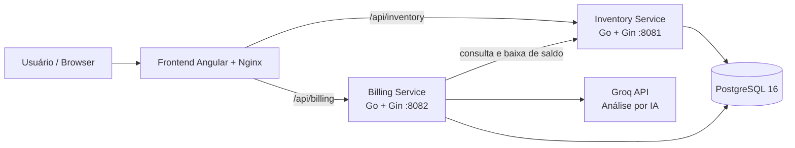

# Detalhamento Técnico - Korp Teste Pedro Frosi

## 1. Introdução

Este projeto implementa um sistema de gerenciamento de notas fiscais com foco em cadastro de produtos, criação de notas, controle de estoque e análise assistida por IA. A solução foi organizada em uma arquitetura distribuída com frontend em Angular, dois serviços backend em Go e um banco PostgreSQL compartilhado.

O contexto de negócio é o de emissão e gestão de notas fiscais com integração entre estoque e faturamento. O frontend concentra a experiência do usuário, o serviço de inventário gerencia produtos e saldo de estoque, e o serviço de billing cuida das notas fiscais, do fechamento da nota e da análise por IA.

## 2. Requisitos

### 2.1 Funcionais

- Cadastrar, editar, listar e excluir produtos.
- Criar notas fiscais com múltiplos itens.
- Consultar a lista de notas e os detalhes de cada nota.
- Fechar/imprimir uma nota fiscal de forma idempotente.
- Validar saldo de estoque antes da criação e do fechamento da nota.
- Baixar estoque item a item e em lote.
- Executar uma análise de apoio por IA sobre o rascunho da nota.

### 2.2 Não funcionais

- Separação de responsabilidades entre frontend, billing e inventory.
- Comunicação entre serviços via HTTP.
- Persistência centralizada em PostgreSQL.
- Proteção contra reprocessamento acidental com idempotência.
- Controle de concorrência no estoque com lock otimista.
- Tratamento padronizado de erros no backend e no frontend.
- Execução em containers com Docker e Docker Compose.

## 3. Arquitetura

### 3.1 Visão geral

### 3.2 Componentes

- **Frontend**: Angular 21 com componentes standalone, roteamento por lazy loading e Angular Material.
- **Inventory Service**: API em Go para CRUD de produtos e operações de baixa de estoque.
- **Billing Service**: API em Go para notas fiscais, impressão/fechamento e análise por IA.
- **Banco de dados**: PostgreSQL 16 compartilhado entre os serviços.
- **Infraestrutura**: Docker Compose orquestrando os containers e Nginx servindo o frontend e fazendo proxy das rotas `/api/inventory` e `/api/billing`.

### 3.3 Integração entre camadas

- O frontend consome as APIs por meio de URLs relativas como `/api/inventory/...` e `/api/billing/...`.
- O Nginx do frontend encaminha essas rotas para os respectivos serviços backend.
- O billing conversa com o inventory para validar saldo e deduzir estoque.
- O billing também integra com a Groq API para produzir a análise por IA.

## 4. Frontend

### 4.1 Estrutura Angular

O frontend foi construído com Angular em modo standalone, sem `NgModule` de aplicação. O roteamento utiliza `loadComponent`, o que reduz o acoplamento e favorece carregamento sob demanda das telas de produtos e notas fiscais.

O ciclo de vida Angular utilizado no projeto é principalmente o **`OnInit`**. Ele aparece nas telas de listagem e formulário para:

- inicializar `FormGroup` e `FormArray`;
- carregar dados iniciais;
- ler parâmetros de rota no fluxo de edição;
- disparar buscas iniciais de produtos e notas.

Não há uso explícito de `OnDestroy`, `AfterViewInit` ou hooks pós-renderização no estado atual do código.

### 4.2 Uso de RxJS

O uso de RxJS é direto e pragmático:

- Os serviços de API retornam `Observable<T>` a partir do `HttpClient`.
- Os componentes usam `BehaviorSubject` para controlar estados de carregamento e impressão.
- O operador `finalize` é usado para encerrar o estado de loading ao final de cada chamada HTTP.
- O interceptor global usa `catchError` e `throwError` para interceptar falhas e repassá-las ao fluxo de tratamento.

Na prática, o RxJS é usado como camada reativa de integração com HTTP e para controle de estado de tela, não como um fluxo complexo de composição de streams.

### 4.3 Bibliotecas e componentes visuais

As bibliotecas visuais e de apoio usadas no frontend incluem:

- **Angular Material**: toolbar, button, icon, table, form-field, input, progress-spinner, snack-bar, divider, chips, card, tooltip, select e button-toggle.
- **RxJS**: suporte ao fluxo assíncrono do frontend.
- **uuid**: geração da `idempotency_key` usada no fechamento/impressão da nota.
- **zone.js**: suporte ao mecanismo padrão de detecção de mudanças do Angular.

### 4.4 Padrões de interface

- Listagens com tabela e ordenação local.
- Formulários reativos com validação no cliente.
- Feedback de carregamento com spinner.
- Mensagens persistentes dentro do componente para erros que exigem correção do usuário.
- `MatSnackBar` para confirmações e erros globais quando apropriado.

## 5. Backend

### 5.1 Frameworks e organização em Go

Os dois serviços backend foram desenvolvidos em Go usando o framework **Gin**.

- Cada serviço possui seu próprio `go.mod`, o que isola dependências e facilita o deploy independente.
- O acesso ao banco é feito com `database/sql` e o driver `github.com/lib/pq`.
- Os serviços expõem rotas REST simples e retornam JSON.

O projeto não utiliza C#, portanto **LINQ não se aplica** neste contexto.

### 5.2 Serviço de inventário

Responsabilidades principais:

- CRUD de produtos.
- Consulta por ID e listagem geral.
- Baixa de estoque individual.
- Baixa de estoque em lote.

Características técnicas relevantes:

- Controle de concorrência com coluna `version` no registro do produto.
- Atualização com lock otimista, evitando perda de atualização em cenários concorrentes.
- Resposta `409 Conflict` quando há conflito de concorrência ou estoque insuficiente.

### 5.3 Serviço de billing

Responsabilidades principais:

- Criação e consulta de notas fiscais.
- Impressão/fechamento de nota com idempotência.
- Validação de estoque antes da criação da nota.
- Integração com o serviço de inventário para baixar estoque no fechamento.
- Análise por IA sobre o rascunho da nota.

Características técnicas relevantes:

- Criação da nota em transação SQL.
- Persistência dos itens da nota em tabela própria.
- Uso de `idempotency_key` para evitar duplicidade no fechamento.
- Retry com backoff simples ao tentar deduzir estoque no inventory.
- Integração com a Groq API para gerar análise em JSON.

### 5.4 Gerenciamento de dependências no Go

O gerenciamento de dependências é feito de forma nativa com `go.mod` e `go.sum`.

- `go mod tidy` organiza e resolve dependências.
- `go build` e `go run` utilizam os módulos declarados em cada serviço.
- As bibliotecas principais são `gin-gonic/gin` e `lib/pq`.

Não há uso de ORM; o acesso ao banco é feito diretamente com SQL, o que deixa a persistência explícita e simples de auditar.

### 5.5 Tratamento de erros e exceções no backend

O tratamento de erros segue um padrão consistente:

- `ShouldBindJSON` invalido gera `400 Bad Request`.
- `sql.ErrNoRows` gera `404 Not Found`.
- Validações de negócio como saldo insuficiente ou nota já fechada geram `409 Conflict`.
- Falhas de dependência externa, como erro na Groq API ou falha de comunicação com o inventário, são propagadas com `500` ou `502` conforme o caso.
- Transações usam `Rollback` em defer para evitar estado parcial quando algo falha.

No billing, a análise por IA também possui guardrails para evitar que a resposta altere itens, quantidades ou descrições do rascunho.

## 6. Modelagem

### 6.1 Tabelas principais

| Tabela          | Finalidade                              | Campos principais                                                                         |
| --------------- | --------------------------------------- | ----------------------------------------------------------------------------------------- |
| `products`      | Cadastro de produtos e saldo em estoque | `id`, `code`, `description`, `balance`, `version`, `created_at`, `updated_at`             |
| `invoices`      | Cabeçalho das notas fiscais             | `id`, `number`, `status`, `closed_at`, `idempotency_key`, `created_at`, `updated_at`      |
| `invoice_items` | Itens vinculados à nota                 | `id`, `invoice_id`, `product_id`, `product_code`, `description`, `quantity`, `created_at` |

### 6.2 Detalhes de modelagem

- `products.code` é único.
- `products.version` suporta lock otimista.
- `invoices.number` é sequencial e inicia em 1000.
- `invoices.status` usa enum com os valores `open` e `closed`.
- `invoices.idempotency_key` é único para evitar reprocessamento.
- `invoice_items.invoice_id` referencia `invoices.id` com `ON DELETE CASCADE`.
- Há trigger de atualização automática de `updated_at` nas duas tabelas principais.

## 7. Fluxos principais

### 7.1 Cadastro e manutenção de produtos

1. O usuário acessa a tela de produtos.
2. O frontend carrega a listagem via serviço de inventory.
3. O formulário usa validação reativa antes de enviar os dados.
4. O backend valida o payload, persiste o produto e retorna o registro criado ou atualizado.

### 7.2 Emissão de nota fiscal

1. O usuário cria uma nota com um ou mais itens.
2. O frontend envia os itens para o billing.
3. O billing valida o saldo de cada produto consultando o inventory.
4. A nota é criada como `open` e os itens são gravados em transação.
5. Se houver conflito de saldo, o frontend recebe a mensagem adequada e exibe o erro no próprio formulário.

### 7.3 Fechamento / impressão da nota

1. O usuário aciona a impressão da nota.
2. O frontend gera uma `idempotency_key` com `uuid`.
3. O billing verifica se a chave já foi processada.
4. Se não houver duplicidade, o billing solicita baixa em lote no inventory.
5. Com a baixa confirmada, a nota é marcada como `closed` e recebe `closed_at`.

### 7.4 Consulta de notas

1. O usuário acessa a listagem de notas fiscais.
2. O frontend carrega os dados do billing.
3. A interface permite ordenar os registros localmente por número, status e datas.
4. A tela de detalhes da nota recupera itens vinculados por ID.

### 7.5 Análise por IA

1. O usuário monta o rascunho da nota.
2. Opcionalmente informa um contexto adicional para análise.
3. Ao clicar em “Analisar com IA”, o frontend envia apenas leitura do rascunho para o endpoint de análise.
4. O serviço de billing envia o payload para a Groq API com instruções para retornar somente JSON.
5. O backend normaliza a resposta, aplica regras determinísticas e devolve resumo, categoria, nível de risco, alertas e recomendações.

## 8. Tecnologias utilizadas

### 8.1 Frontend

- Angular 21
- TypeScript 5.9
- RxJS 7.8
- Angular Material
- zone.js
- uuid

### 8.2 Backend

- Go 1.26
- Gin Framework
- `database/sql`
- `github.com/lib/pq`

### 8.3 Banco e infraestrutura

- PostgreSQL 16
- Docker
- Docker Compose
- Nginx

### 8.4 Integração externa

- Groq API para análise assistida por IA

## 9. Considerações

### 9.1 Segurança

- Segredos e credenciais são carregados por variáveis de ambiente.
- A análise por IA não altera automaticamente itens, quantidades ou descrições.
- A impressão da nota usa idempotência para reduzir duplicidade em retry e duplo clique.

### 9.2 Escalabilidade

- A separação em microsserviços permite escalar inventory e billing de forma independente.
- O uso de PostgreSQL com pool de conexões reduz custo de abertura de conexões.
- O frontend é estático e pode ser servido por Nginx com cache de assets.

### 9.3 Logs e auditoria

- O backend usa logs estruturados com `log.Printf` e `log.Fatalf` para eventos críticos.
- As tabelas possuem `created_at` e `updated_at` para rastreabilidade temporal.
- A estrutura da nota e seus itens permite reconstruir o contexto histórico da operação.

### 9.4 Observações sobre cancelamento

- Não há endpoint de cancelamento implementado no estado atual do repositório.
- Caso essa regra seja adicionada, o fluxo precisará prever reversão de estoque, mudança de status e auditoria da operação.

## 10. Atendendo aos itens obrigatórios do desafio

- **Ciclos de vida do Angular utilizados**: `OnInit` nas telas de listagem e formulário.
- **Uso de RxJS e como foi utilizado**: `Observable` nos serviços HTTP, `BehaviorSubject` para estados de tela, `finalize` para encerrar loading e `catchError` no interceptor global.
- **Outras bibliotecas utilizadas e suas finalidades**: `uuid` para idempotência; `zone.js` para o runtime do Angular; `lib/pq` para PostgreSQL; `Gin` para HTTP no backend.
- **Bibliotecas de componentes visuais utilizadas**: Angular Material, incluindo tabela, formulários, cards, chips, botões, ícones, snack-bar, tooltip e spinner.
- **Gerenciamento de dependências no Golang**: `go.mod` e `go.sum` em cada serviço, sem ORM.
- **Frameworks utilizados no Golang ou C#**: Gin no backend Go; não há C# neste projeto.
- **Tratamento de erros e exceções no backend**: validação de payload, resposta padronizada em JSON, mapeamento de `400`, `404`, `409` e `502`, transações com rollback e tratamento de falhas externas.

---

Documento preparado para apoiar a entrega técnica do desafio.
